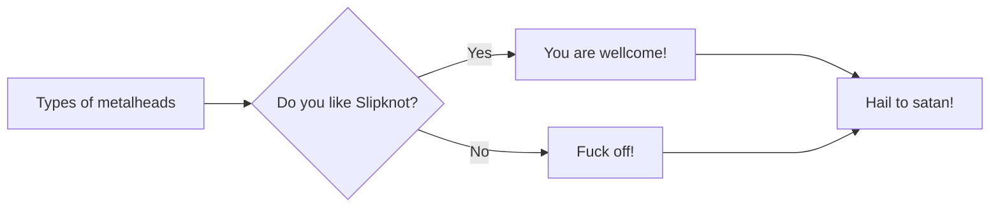

# ya-git
## Выполнение задания в рамках курса [Yandex-practicum](https://practicum.yandex.ru/) по работе с git. 

## Комманды для работы с git.

 ### 1. git add
 
Команда git add добавляет содержимое рабочего каталога в индекс (staging area) для последующего коммита.

### 2. git status

Команда git status показывает состояния файлов в локальном репозитории и индексе: какие файлы изменены, но не добавлены в индекс; какие ожидают коммита в индексе. Вдобавок к этому выводятся подсказки о том, как изменить состояние файлов.

### 3. git commit

Команда git commit берёт все данные, добавленные в индекс с помощью git add, и делает их снимок в локальном репозитории, а затем сдвигает указатель текущей ветки на этот снимок.

### 4. git reset

Команда git reset, как можно догадаться из названия, используется в основном для отмены изменений. 

### 5. git branch

Команда git branch — это своего рода “менеджер веток”. Она умеет перечислять ваши ветки, создавать новые, удалять и переименовывать их.

### 6. git checkout

Команда git checkout используется для переключения веток и выгрузки их содержимого в рабочую директорию.

### 7. git merge

Команда git merge используется для слияния одной или нескольких веток в текущую. Затем она устанавливает указатель текущей ветки на результирующий коммит.

### 8. git log

Команда git log выводит подробный log всех коммитов.

Команда git log --oneline выведет сохращенный список коммитов и их сокрашенные хэши. 

___

## Хеши.
Хеширование - способ преобразовать набор данных и получить их отпечаток. Информация о коммите - набо данных: когда мыл сделатн коммит, содержимое файлов в репе и ссылка на пердыдущий коммит. 

Git хеширует информацию о коммите с помощью SHA-1 (Secure Hash Algorithm, отсылка к квантовой устойчивости))) и получает для каждого коммита свой уникальный хеш - результат хеширования.

Хеш - основной идентификатор коммита. 
---

## Элементы описания коммита.

Строка из цифр и латинских букв после слова commit — это хеш коммита.

Author — имя автора и его электронная почта.

Date — дата и время создания коммита.

В конце находится сообщение коммита.

---

## Жизненный цикл файлов git.
 

Украл картинку у [Yandex-practicum](https://practicum.yandex.ru/) для наглядности.

___

### Моя первая mermaid-sheme.

___

## Исправление коммита.

Что-бы внести правки в уже сделанный коммит можно использовать комманду git commit --amend (от англ. amend - "исправить", "дополнить").

Важно: опция --amend работает только с последним коммитом (HEAD). 

___ 
